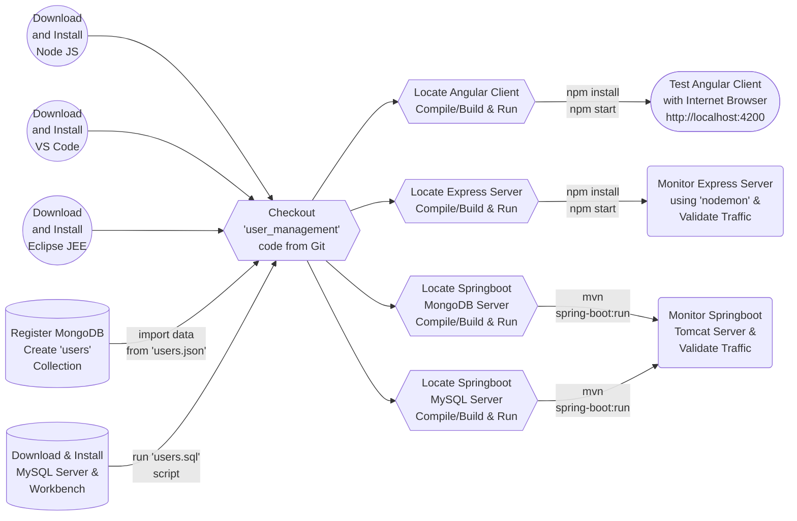

# 👨‍👩‍👧‍👦🇺ser 🇲anagement 🇼eb 🅰️pplication
How to Create Secure User Management Web Application using Node JS, Express JS, Angular and JWT.

### Workflow

User Management Web Application consisting the following modules:

## 🌐Client
### 🅰️ngular Web Application Client
"client/angular" folder contains the web based single page application client created with Angular.

## 📡Server
### 🇪xpress Application/Web Server with JWT and MongoDB
"server/express-jwt-mongodb" folder contains the web application server created with "express" and "jsonwebtoken" with "Node.js" JavaScript library. The data is stored to the MongoDB server.

### 🇸pringboot 🇹omcat Application/Web Server with 🇯WT and 🇲ongoDB
"server/springboot-jwt-mongodb" folder contains the web application server created with "Springboot" and "io.jsonwebtoken" Java libraries. The data is stored to the MongoDB Database server.

### 🇸pringboot 🇹omcat Application/Web Server with 🇯WT and 🇲ySql
"server/springboot-jwt-mysql" folder contains the web application server created with "Springboot" and "io.jsonwebtoken" Java libraries. The data is stored to the MySql Database server.

## 💻Database
### 🇲ongoDB
"database/mongodb" folder contains necessary script and data for the users collection.  In order to run the script one will require to have the appropriate environment variable setup and have the MongoDB Command Line Database Tools.

### 🇲ySql
"database/mysql" folder contains necessary SQL script to create necessary MySQL database/schema, table and load data .

### Getting Started
<ul>
<li>Download <a  href="https://nodejs.org/en/download">NodeJS</a> and install</li>
<li>Download <a  href="https://code.visualstudio.com/download">Visual Studio Code</a> and install</li>
<li>Download <a  href="https://www.eclipse.org/downloads/packages/">Eclipse IDE for Enterprise Java and Web Developers </a> and install</li>
<li>Create a free account on <a  href="https://account.mongodb.com" target="_new">MongoDB</a></li>
<li>Download and install the <a  href="https://www.mongodb.com/try/download/database-tools" target="_new">MongoDB Command Line Database Tools</a></li>
<li>Create <code>users</code> Collection.  Copy the connection information.  Alternatively, you can import data from <code>users.json</code> by running the <code>database\mongodb\import.cmd</code> on windows</li>
<li>Download <a  href="https://dev.mysql.com/downloads/mysql/">MySQL Community Server </a> and install</li>
<li>Download <a  href="https://www.mysql.com/products/workbench/">MySQL Workbench</a> and install</li>
<li>Create necessary MySQL database/schema, table and load data by executing the <code>database\mysql\users.sql</code> SQL script using the MySQL Workbench.</li>
<li>Set the following environment variables related to your database connection information and database name <code>USER_MGMT_MONGO_DB 
USER_MGMT_MONGO_URI</code></li>
<li>Checkout <a  href="https://github.com/lalumastan/user_management.git">this code</a> from Github</li>
<li>Locate angular client code. Compile/build & run the code using <code>npm install npm start</code></li>
<li>Locate express server code. Compile/build & run the code using <code>npm install npm start</code></li>
<li>Locate springboot mongodb server code. Compile/build & run the code using <code>mvn spring-boot:run</code></li>
<li>Locate springboot mysql server code. Compile/build & run the code using <code>mvn spring-boot:run</code></li>
<li>Open <a  href="http://localhost:4200"  target="_new">http://localhost:4200</a> with your browser to interact with the user management web application.</li>
</ul>

### References
<ul>
<li><a  href="https://icsdiscover.great-site.net/?site=aw"  target="_new">Advanced Application Demo</a></li>
<li><a  href="https://nextjs.org/learn"  target="_new">Interactive Next.js tutorial</a></li>
<li><a  href="https://nextjs.org/docs"  target="_new">Next.js Documentation</a></li>
<li><a  href="https://www.w3schools.com/angular/"  target="_new">Learn Angular</a></li>
<li><a  href="https://www.geeksforgeeks.org/express-js/"  target="_new">Learn Express JS</a></li>
<li><a  href="https://spring.io/projects/spring-boot"  target="_new">Springboot</a></li>
<li><a  href="https://spring.io/projects/spring-security"  target="_new">Spring Security</a></li>
<li><a  href="https://www.geeksforgeeks.org/jwt-authentication-with-node-js/"  target="_new">Learn JWT</a></li>
</ul>

### Tutorials
## Part1️⃣

## Part2️⃣

## Part3️⃣

## Part4️⃣
