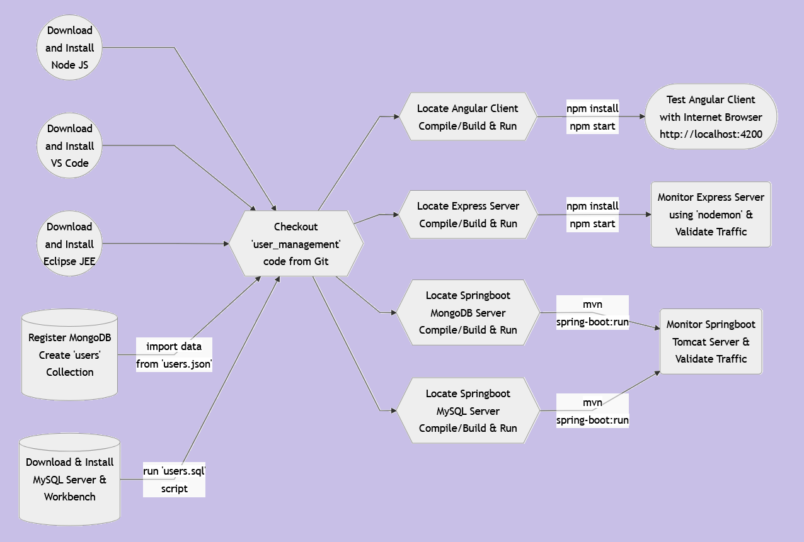

# 👨‍👩‍👧‍👦🇺ser 🇲anagement 🇼eb 🅰️pplication
How to Create Secure User Management Web Application using Node JS, Express JS, Angular and JWT.

### Workflow

  

  

  

  

User Management Web Application consisting the following modules:

## 🌐Client
### 🅰️ngular Web Application Client
"client/angular" folder contains the web based single page application client created with Angular.

## 📡Server
### 🇪xpress Application/Web Server with JWT and MongoDB
"server/express-jwt-mongodb" folder contains the web application server created with "express" and "jsonwebtoken" with "Node.js" JavaScript library. The data is stored to the MongoDB server.

### Getting Started
<ul>
<li>Download <a  href="https://nodejs.org/en/download">NodeJS</a> and install</li>
<li>Download <a  href="https://code.visualstudio.com/download">Visual Studio Code</a> and install</li>
<li>Create a free account on <a href="https://account.mongodb.com" target="_new">MongoDB</a></li>
<li>Create <code>users</code> Collection.  Copy the connection information</li>
<li>Set the following environment variables related to your database connection information and database name <code>USER_MGMT_MONGO_DB 
USER_MGMT_MONGO_URI</code></li>
<li>Checkout <a  href="https://github.com/lalumastan/user_management.git">this code</a> from Github</li>
<li>Locate express server code.  Compile/build & run the code using <code>npm install npm start</code></li>
<li>Locate angular client code.  Compile/build & run the code using <code>npm install npm start</code></li>
<li>Open <a  href="http://localhost:4200" target="_new">http://localhost:4200</a> with your browser to interact with the user management web application.</li>
</ul>

### References
<ul>
<li><a  href="https://icsdiscover.great-site.net/?site=aw" target="_new">Advanced Application Demo</a></li>
<li><a  href="https://nextjs.org/learn" target="_new">Interactive Next.js tutorial</a></li>
<li><a  href="https://nextjs.org/docs" target="_new">Next.js Documentation</a></li>
<li><a  href="https://www.w3schools.com/angular/" target="_new">Learn Angular</a></li>
<li><a  href="https://www.geeksforgeeks.org/express-js/" target="_new">Learn Express JS</a></li>
<li><a  href="https://www.geeksforgeeks.org/jwt-authentication-with-node-js/" target="_new">Learn JWT</a></li>
</ul>

  

### Tutorial
## Part1️⃣

## Part2️⃣

